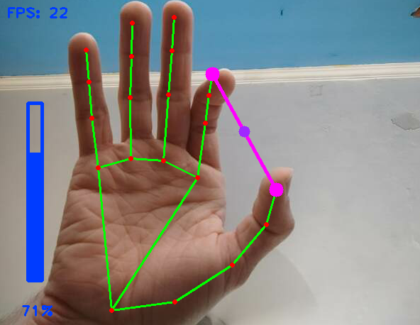
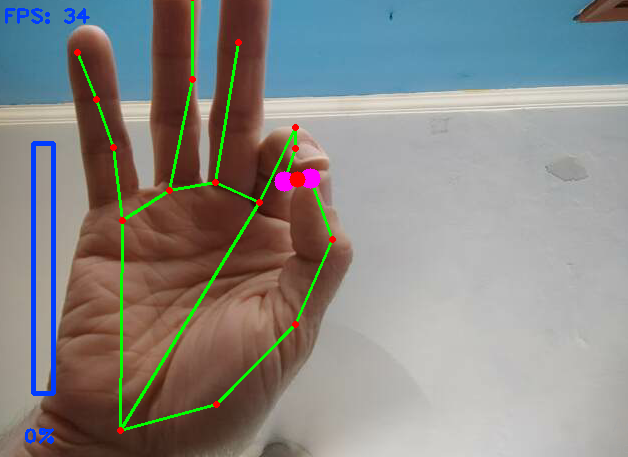

# Gesture-Volume-Control
Volume control using hand gestures with computer vision. Inspired by the freeCodeCamp course on Computer Vision.

Volume control is handled with the pycaw module by AndreMiras: https://github.com/AndreMiras/pycaw

This simple program uses the hand tracking module (https://github.com/NikoSilveira/Image-Recognition-Modules/tree/main/1.%20Hand%20Tracking) to scan the distance between the thumb and index fingers. Then, the program rescales the distance values into a volume range to dynamically adjust the system's master volume.

